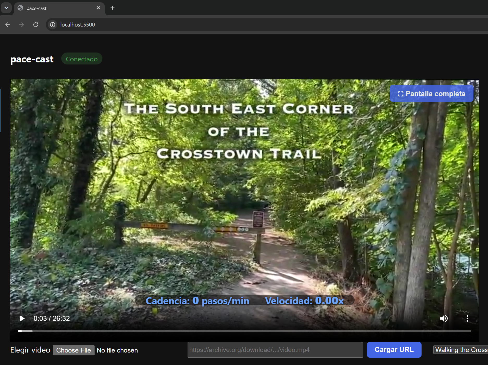

# pace-cast

POC: usar un HTC VIVE Ultimate Tracker como sensor de marcha para controlar la velocidad de reproduccion de un video pregrabado (walkthrough en primera persona). Al "marchar" en el lugar, la cadencia detectada ajusta `video.playbackRate` en tiempo real, manteniendo el tono del audio (`preservesPitch`).



## Prerequisitos

- **Windows** (obligatorio). SteamVR no tiene soporte funcional en macOS, y todo este pipeline depende de SteamVR/OpenVR.
- **Python 3.10+** instalado y en el PATH.
- **Steam + SteamVR** instalados.
- **VIVE Hub** instalado (la app de HTC para emparejar y actualizar firmware del Ultimate Tracker).
- **HTC VIVE Ultimate Tracker(s) + VIVE Wireless Dongle** (USB-C).
- Un navegador basado en Chromium (Chrome o Edge) para la app web.

## Preparar el Ultimate Tracker

El Ultimate Tracker no usa estaciones base: se ubica a si mismo con sus propias camaras (SLAM/inside-out), igual que un headset standalone. Esto lo hace **muy sensible a la iluminacion y al contenido visual del espacio**: habitaciones oscuras, pisos lisos sin patron, o paredes vacias hacen que pierda tracking constantemente. Antes de usarlo:

1. **Conecta el dongle** a un puerto USB. Si el dongle esta en un puerto **USB 3.0** (azul) y ves tracking inestable, cambialo a un puerto USB 2.0 o usa el cable extensor incluido — es la causa mas comun de interferencia reportada con trackers VIVE.
2. **Abre VIVE Hub**, enciende el/los tracker(s) y emparejalos con el dongle si es la primera vez. Verifica ahi mismo:
   - Nivel de bateria.
   - Version de firmware (actualiza si VIVE Hub lo sugiere).
3. **Abre SteamVR** y confirma que el tracker aparece como dispositivo activo (icono sin advertencias). Si el estado queda parpadeando entre "Ready" y "Tracking Lost" de forma permanente:
   - Mejora la iluminacion del espacio (luz uniforme, evita contraluz y oscuridad).
   - Evita superficies lisas/reflectantes o completamente vacias en el campo de vision del tracker; agregar objetos con textura (muebles, afiches, alfombra con patron) ayuda al SLAM.
   - Si el tracker va en el tobillo, verifica que la correa o la tela del pantalon no tape su lente.
   - Corre el **Room Setup** de SteamVR (de pie) al menos una vez en el espacio donde vas a usarlo.
4. **SteamVR sin headset (setup solo-trackers):** por defecto SteamVR requiere detectar un HMD para inicializar y falla con `InitError_Init_HmdNotFound` si solo tienes trackers. Para evitarlo, habilita el driver "null" (headset falso) que trae SteamVR:
   - Cierra SteamVR por completo (icono de la bandeja del sistema -> Exit).
   - Edita `C:\Program Files (x86)\Steam\steamapps\common\SteamVR\drivers\null\resources\settings\default.vrsettings` y cambia `"enable": false` a `"enable": true` en la seccion `driver_null` (puede pedir permisos de administrador para guardar).
   - Vuelve a abrir SteamVR; deberia iniciar sin pedir el headset.
   - Nota: el driver null tiene `loadPriority` muy bajo, asi que si en otro proyecto usas un headset real conectado, SteamVR deberia preferirlo automaticamente sobre el driver null sin que tengas que revertir el cambio — pero conviene verificarlo la primera vez.

## Estructura

```
pace-cast/
  python/         # lectura de pose (OpenVR), deteccion de cadencia, servidor WebSocket
  app/            # interfaz web: <video> controlado por playbackRate
  documentation/  # bitacora tecnica de la implementacion (dev_log.md)
```

## Setup del entorno Python

```bash
cd python
python -m venv venv
venv\Scripts\activate
pip install -r requirements.txt
```

## Uso

### 1. Levanta el puente tracker -> WebSocket

Con SteamVR abierto y el tracker en estado "Ready":

```bash
cd python
venv\Scripts\python.exe server.py
```

Deberia imprimir `Tracker listo (simulate=False). Sirviendo en ws://localhost:8765`.

Sin hardware, para probar el resto del pipeline con un caminante sintetico (~96 pasos/min):

```bash
venv\Scripts\python.exe server.py --simulate
```

### 2. Abre la app web

Abre `app/index.html` directamente en Chrome o Edge (doble clic, o `file://` en la barra de direcciones). El estado en la esquina superior deberia pasar de "Desconectado" a "Conectado" apenas el servidor Python este corriendo.

### 3. Carga un video

Tres formas, en la fila de controles debajo del video:

- **Archivo local**: boton "Elegir video", selecciona cualquier archivo de video de tu equipo.
- **URL directa**: pega el link directo a un archivo de video (no la pagina, el archivo) y presiona "Cargar URL". Funciona bien con archive.org: entra al item, ve a "Download options", copia el link del `.mp4` (formato `https://archive.org/download/<identifier>/<archivo>.mp4`). Estos links soportan HTTP Range requests, asi que el video puede buscar/hacer seek sin descargarse completo — evitas ademas subir el archivo de video al repo (GitHub limita 100 MB por archivo).
- **Lista**: selector "Elegir de la lista" con videos de ejemplo predefinidos en [`app/videos.js`](app/videos.js) (por ahora, un walkthrough de archive.org). Agrega entradas ahi para sumar mas videos.

### 4. Marcha

Con el tracker puesto en el tobillo o la pierna y el video cargado, "marcha" en el lugar (sube y baja las piernas como si caminaras). La cadencia detectada (pasos/min, ventana de 4 s) se traduce a `video.playbackRate` en tiempo real:

- Sin movimiento -> cadencia 0 -> el video se pausa.
- A mas cadencia, mas rapido el video (rango `[0.25x, 2.0x]`, 100 pasos/min = 1.0x).

Sobre el video hay un overlay (HUD) centrado en la parte baja, en azul, con la cadencia y la velocidad actuales. El boton **"⛶ Pantalla completa"** (esquina superior derecha del video) fullscreenea el video **junto con el overlay** — el icono nativo de pantalla completa del reproductor esta deshabilitado a proposito porque solo agrandaria el video, dejando el HUD afuera.

## Como funciona

1. `python/pose_reader.py` consulta la pose del tracker generico via `IVRSystem.GetDeviceToAbsoluteTrackingPose` a ~90 Hz.
2. `python/cadence.py` remuestrea la posicion vertical, detecta picos (`scipy.signal.find_peaks`) y calcula pasos/min sobre una ventana deslizante de 4 s.
3. `python/server.py` mapea cadencia -> `playbackRate` (lineal, 100 pasos/min = 1.0x, rango [0.25x, 2.0x]) y lo transmite por WebSocket a ~15 Hz.
4. `app/app.js` recibe el mensaje y ajusta `video.playbackRate`, manteniendo `preservesPitch = true` para evitar distorsion de tono en el audio.

Detalle tecnico completo, decisiones y problemas resueltos durante la implementacion: [`documentation/dev_log.md`](documentation/dev_log.md).

## Pendiente

- Calibrar `baseline_cadence` y el rango de `playbackRate` contra la velocidad real de camara del video (metros/paso del walkthrough).
- Filtrar falsos positivos de `find_peaks` cuando el tracker se mueve por otras razones (ajustarselo, quitarselo, etc).
- Suavizado adicional de `playbackRate` (ej. EMA) si los cambios de velocidad se sienten bruscos.
